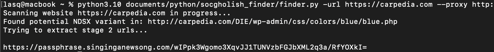

# SocGholish Finder

Simple script to scan website for SocGholish inject. It checks for and display inject if found, and it deonfuscates and display a shadowing URL domains

```
usage: finder.py [-h] [-url URL] [-ua USER_AGENT] [-f FILENAME] [-p PROXY] [-s]

SocGholish finder

options:
  -h, --help            show this help message and exit
  -url URL              URL to check
  -ua USER_AGENT, --user-agent USER_AGENT
                        Specify User-Agent to use with the request
  -f FILENAME, --filename FILENAME
                        csv of domains to check
  -p PROXY, --proxy PROXY
                        Proxy server to use, supported format: http(s)://user:password@proxy.tld
  -s, --scripts         list all the scripts on the website with their content (useful for debugging or when script doesn't provide correct results)
```

Standard


NDSX
